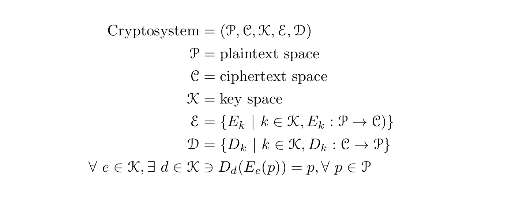

# Cryptography in a Nutshell

### Contents
[Why Cryptography?](#why-cryptography)

[The Golden Rule](#the-golden-rule)

[What Is Cryptography?](#what-is-cryptography)

[The Cryptosystem](#the-cryptosystem)

[Keys](#keys)

[Encryption Algorithms](#encryption-algorithms)

*[Back](../week2-cryptography#week-2---cryptography)*


## Why Cryptography?
The "C" and the "I" in the CIA Triad


## The Golden Rule
DON'T ROLL YOUR OWN CRYPTO!!!


## What Is Cryptography?
__Cryptography__: The process of communicating secretly through the use 
of ciphers

__Cryptanalysis__: The process of cracking or deciphering encrypted info

__Cryptology__: The study of cryptography or cryptanalysis

__Cleartext / plaintext__: Unencrypted infomation

__Encrypt__: To convert info or data into code to prevent unauthorized
access

__Decrypt__: To convert an encoded or unclear message into plaintext

__Cipher__: An algorithm to perform encryption and / or decryption

__Cryptosystem__: A suite of algorithms used to perform encryption and / or 
decryption

__Base64__: An encoding scheme used for representing binary data using 
printable (text) characters
- Used for HTTP Basic Authentication


## The Cryptosystem
A cryptosystem can be formalized as a tuple consisting of 5 elements: 
P, C, K, E, and D (see mathematical definition below). 'P' represents 
a set containing information in plaintext. 'C' represents a set 
containing information in ciphertext. 'K' represents a set containing 
keys. 'E' represents a set of functions such that for every key 'k', 
there exists a function from 'P' to 'C'. In other words, E represents 
a set of functions, each corresponding to a unique key, who encrypt 
information in plaintext. 'D' represents a set of functions such that 
for every key 'k', there exists a function from 'C' to 'P'. In other 
words, 'D' represents a set of funcions, each corresponding to a 
unique key, who decrypt information in ciphertext.

Therefore, a cryptosystem contains information in plaintext, information 
in ciphertext, keys, encryption functions, and decryption functions.



### Evaluating the Security of a Cryptosystem
There only exists one perfectly secure algorithm: the One-Time Pad (OTP). 
All other crypto algorithms are not perfectly secure. However, they 
do not need to be perfectly secure; they just need to be secure enough 
to the point where attempting to break the cipher is just not worth it.
In other words, to evaluate the security of a cryptosystem is to make a 
cost-benefits analysis of the system in question, The higher the ratio 
of cost to benefits, the more secure the algorithm is. There are two 
main tradeoffs to be considered regarding cipher breaking:

1. When the cost of breaking the cipher exceeds the value of the 
   encrypted information.

2. When the time required the break the cipher exceeds the useful 
   lifetime of the information.

However, it is difficult to estimate the cost and time required to 
break a cipher. Where brute-forcing may take several lifetimes, stealing 
a key may take several minutes.


## Keys
In the context of cryptography, a key defines the transformation 
between plaintext and ciphertext. For encryption algorithms, the 
key specifies the transformation *from* plaintext *to* ciphertext. 
For decryption algorithms, the key specifies the transformation 
*from* ciphertext *to* plaintext.

> Il faut qu’[un système cryptographique] n’exige pas le secret, 
et qu’il puisse sans inconvénient tomber entre les mains de l’ennemi. -
__Auguste Kerckhoffs, ["La cryptographie
  militaire"](https://petitcolas.net/kerckhoffs/la_cryptographie_militaire_i.htm)__

In English:
> It is paramount that a cryptosystem does not rely on its key, and that 
there would be no problems if the cryptosystem falls into the hands of the 
enemy. - __Auguste Kerckhoffs, "Military Cryptography"__

In other words, a good cryptosystem maintains security, even in the hands 
of others, as long as the key is kept safe.

### Uses of Keys
**_The Caesar Cipher_**

The Caesar cipher is a simple encryption algorithm used by Julius Ceasar to
protect his correspondances. To encrypt information, one would rotate the 
alphabet by a certain number, therefore mapping each "real" letter with 
a "fake" letter. For example, the ROT13 cipher is a version of the Caesar 
cipher in which the alphabet is rotated 13 spaces

Let 'A' = 1, 'B' = 2, ..., 'Z' = 26. To encrypt, one rotates the alphabet 
13 spaces so that 'A' = 13, 'B' = '14', ..., 'Z' = 12. Next, one maps the 
the old alphabet to the new alphabet such that a letter in the old 
alphabet replaces its corresponding letter in the new alphabet. For 
example, in the old alphabet, 'M' = 13. Therefore, 'M' will replace 'A' 
in the encrypted text. Hence, if I were to encrypt "ABC" using ROT13,
the resulting string would be "MNO". 

It is somewhat a pain trying to decode a piece of text encrypted using 
the Caesar cipher if one does not know how many spaces the alphabet was 
rotated. In the case of a ROT13 cipher, once one realizes that the 
alphabet was rotated 13 spaces, it becomes fairly easy to decode.

The number of spaces the alphabet is rotated is the key. Therefore, the 
ROT13 cipher contains the key 'k' = 13.

**_One-Time Pad (OTP)_**

The One-Time Pad is an uncrackable encryption technique whose security 
relies on the complexity of the key. Specifically, the key is a one-use 
only, pre-shared key that is truly random, at least as long as the 
plaintext, never reused, and kept secret. However, OTP encryption is 
unviable, as secure key distribution is very difficult to do.


## Encryption Algorithms

There are three main types of encryption algorithms: one-way algorithms, 
symmetric-key algorithms, and public-key algorithms.

### One-Way Algorithms
AKA hash functions, such algorithms are one-way as they can only encrypt 
information, not decrypt. Therefore there is no secret key. The function 
maps a variable length string of data to produce a fixed-length output 
in a deterministic, public, and random manner. 

Many one-way algorithms use __salts__ to better secure their stored values. 
Salts are unique, random data that are appended to the end of a value before 
hashing and storing. Therefore, if two users store the same password, the 
hashed values stored would be different, as they both contain different salts.
NEVER reuse your salts and make sure they aren't too short.

The perfect hash faction
- Is one-way, and thus not decryptable
- Contains no collisions
- Exhibits true randomness
- Contains pre-image resistance, making it unfeasible to produce the entire
  hash space
- Makes it unfeasible to produce a string, given a hash result

Pros
- Good for verifying integrity

Cons
- MD5 (128-bit hash values) is not collision-resistant
- SHA1 (160-bit has value) is not collision-resistant

Uses
- For password storage
- As a checksum of software packages
- As digital signatures
- As Git commits

Example - Verifying the Integrity of a Download
```bash
foo@bar:~$ shasum -a 256 <EXCECUTABLE>
```

If the result does not match the provided checksum (SHA256 in this case), 
the download is either corrupted or was tampered.

**_MD5 (Insecure)_**: [RFC 1321](https://tools.ietf.org/pdf/rfc1321.pdf)

**_SHA1 (Insecure)_**: [RFC 3174](https://tools.ietf.org/pdf/rfc3174.pdf)

**_SHA256 & SHA512_**: [RFC 4634](https://tools.ietf.org/pdf/rfc4634.pdf)

### Symmetric-Key Algorithms
Symmetric-key algorithms use a single key between a pair of encryption and 
decryption functions. In other words, A file encrypted with a key 'k' is 
also decrypted with the key 'k'. An example of a symmetric-key algorithm is 
the OTP.

Pros
- Fast
- A modified key 'k' will result in garbage plaintext after decryption

Cons
- Security depends on the secrecy of the key
- Not good for authenticity

Uses
- Password protecting a ZIP file using AES

**_DES (Deprecated)_**: [FIPS
46-3](https://csrc.nist.gov/csrc/media/publications/fips/46/3/archive/1999-10-25/documents/fips46-3.pdf)

**_AES_**: [FIPS 197](https://nvlpubs.nist.gov/nistpubs/FIPS/NIST.FIPS.197.pdf)

**_RC4 (Insecure)_**: [RFC 7465](https://tools.ietf.org/pdf/rfc7465.pdf) 

### Public-Key Algorithms
AKA asymmetric-key algorithms, public-key algorithms use keys, a public 
key (of which anyone can have), and a private key (of which should be 
unique to each user). A public key is used for encryption whilst a 
private key is used for decryption. Therefore, if one wishes to send 
an encrypted email to another, they would first both agree on a 
cryptosystem. Next, they share their public keys with each other.
Person A encrypts an email using Person B's public key. Person B decrypts 
the email with their own private key. 

Pros
- Public key can safely be distributed in any way possible
- Confidentiality - only the holder of the private key can decrypt
- Integrity - Any modification of the message would be evident during
  the decryption process
- Non-repudiation - each individual can prove who the originator of a
  message is

Cons
- No authentication - anyone can encrypt a message given a public key
- Is still vulnerable to a MITM attack

Uses
- SSL / TLS
- SSH and SSH keys (public key stored on server while client keeps private 
  key)
- PGP (Pretty Good Privacy)
- GPG (formerly known as OpenPGP)
- Bitcoin

**_Public Key Fingerprint_**: a short sequence of bytes used to identify a
larger public key. The fingerprint is generated by hashing the public key.

**_RSA_**: [RFC 3447](https://tools.ietf.org/pdf/rfc3447.pdf)

**_Diffie-Hellman (DH)_**

The Diffie-Hellman key exchange is a method of exchanging cryptographic 
keys via public and insecure channels.

Step 1 (The Setup): Person A and Person B publically agree on an unique 
and abitrary constant (e.g. modulus 'p' = 23 and base 'g' = 5). Each 
person combines the established constant with their own secret (e.g. 
secret 's' = 4, such that the combined result = g^s mod p = 5^4 mod 23 
= 4). 

Step 2 (Sharing is Caring): Person A and Person B publically share their 
combined results with each other. Let Person A have the secret 's' = 4 so 
that the resulting combination value is 5^4 mod 23 = 4. Person A would 
send Person B the number 4. Person B would send their own resulting value 
to Person A.

Step 3 (The Magic): Each person combines their own secret with the value 
that they received from the other. Because of some mathematical magic, 
they both end up with the same value, which becomes their shared key.

Therefore, the individuals aren't really exchanging keys publically, but 
are instead creating a key together.

*The Paint Analogy*


