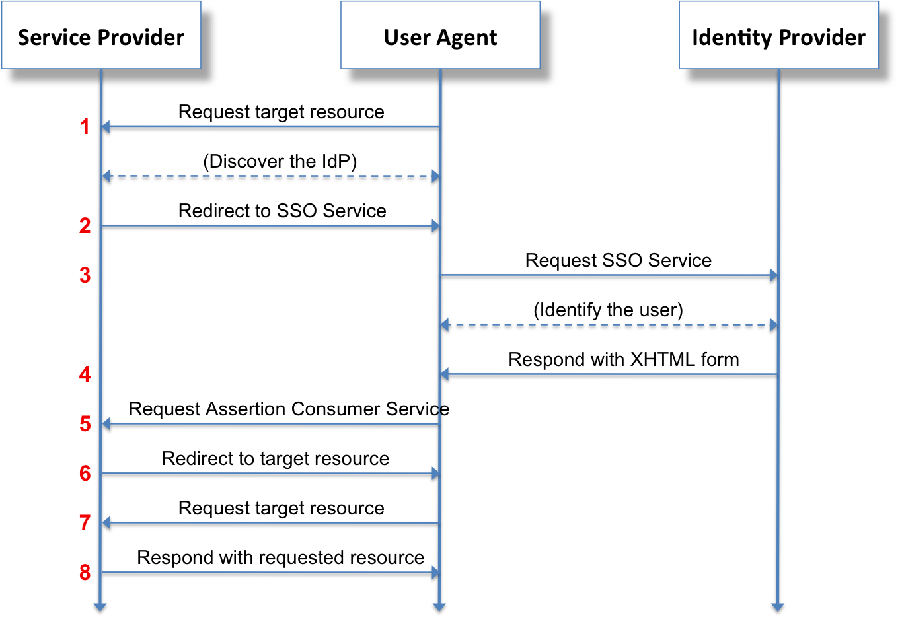

# IdM - Identity Management

__{ Identity management }__ Framework of policies and tech for managing identities,
access, and authorization. Main functions:

1. Creation, management, and deletion of identities
2. Authentication
3. Access control 
4. __{ Federated identity }__ Cross-system identity authentication (e.g. SSO)

### Identity
- Identities correspond to entities (e.g. people, orgs)
- Identities are defined through a set of axioms (e.g. all identities are 
  unique)
- Identities consist of attributes

### Authentication
- Checks and validates identities

### Access Control
- Controls what each identity has access to and what they can do

### Federated Identity
- Allows multiple systems to share user access and identity authentication

## SSO

### Key Considerations
1. Who are the users?
    - Usability and accessability
2. What are the organization's SSO requirements?
3. What data is stored where?
4. Who should have access to what data?

### SAML 2.0

__{ SAML 2.0 }__ An authentication standard that uses security tokens to
provide assertions between a user, SP, and IdP through an XML-based protocol.
"SAML" stands for "Security Assertion Markup Language".

#### Components
1. User agent (e.g. browser)
2. Service provider (SP)
3. Identity provider (IdP)
    - Validates identity and determines access controls
4. Assertions
    - Data in the SAML response about the user (e.g. permissions)
5. Globally Unique Identifier
    - A value that lets the IdP identify an SP

#### SSO Process
Login process example:

1. User accesses SP (e.g. app)
2. If SP doesn't recognize user, SP creates and sends SAML request (containing
   Globally Unique Identifier) to IdP
3. If IdP identifies user, creates SAML response (contains assertions), sends 
   response to SP. Else, IdP handles authentication errors
4. SP verifies response and authorizes user

(Source: [Tom Scavo](https://bit.ly/2VZdP5y)/[CC BY-SA](https://creativecommons.org/licenses/by-sa/3.0/))

#### Assertions
Assertions primarily consist of statements associated with a user 
(`<Subject>`). Three main types of assertions:

1. Authentication Assertion: User was authenticated by process X at time Y.
2. Attribution Assertion: User is associated with the provided attributes.
3. Authorization Decision Assertion: Response to user's request for access to 
   a resource (e.g. granted or denied)
