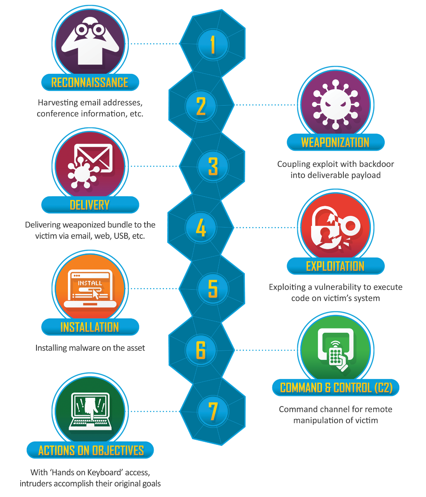

# Cyber Notes

### [Week 1 - Networks](./week1-networks#week-1---networks)

[An Introduction to Cyber Security](./week1-networks/notes-00-intro.md#an-introduction-to-cyber-security)

[Basic Networking](./week1-networks/notes-01-networking.md#basic-networking)

[Network Security](./week1-networks/notes-02-netsec.md#network-security)

### [Week 2 - Cryptography](./week2-cryptography#week-2---cryptography)

[Cryptography in a Nutshell](./week2-cryptography#week-2---cryptography/notes-03-crypto-intro.md#cryptography-in-a-nutshell)

[Cryptography and Cyber Security](./week2-cryptography#week-2---cryptography/notes-04-using-crypto.md#cryptography-and-cybersecurity)

### [Week 3 - Web Security](./week3-websecurity#week-3---web-security)

[The
Web](./week3-websecurity#week-3---web-security/notes-05-web-intro.md#the-web)

[Web
Security](./week3-websecurity#week-3---web-security/notes-06-websec.md#web-security)

---

*The Cyber Kill Chain* ([Source](https://www.lockheedmartin.com/en-us/capabilities/cyber/cyber-kill-chain.html))

