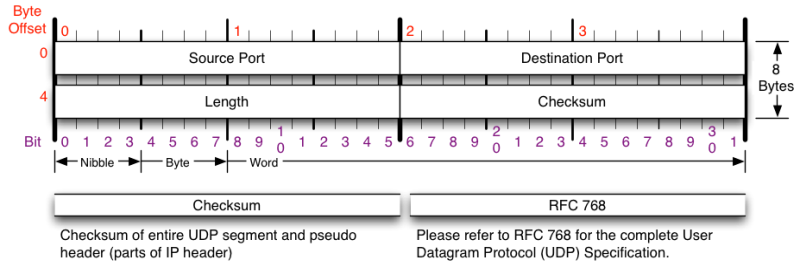

# Week 1 - Basic Networking

### Contents
[Why Networking and NetSec?](#why-networking-and-netsec)

[The Cyber Attribution Problem](#the-cyber-attribution-problem)

[What Is Networking?](#what-is-networking)

[The OSI Model](#the-osi-model)

[The Internet Protocol Suite - TCP/IP Model](#the-internet-protocol-suite---tcpip-model)

[The OSI Model vs the TCP/IP Model](#the-osi-model-vs-the-tcpip-model)


## Why Networking and NetSec?
- The Trinity of Trouble - "Connectivity"
- Critical to understanding the cyber attribution problem


## The Cyber Attribution Problem
__Attribution__: the action of regarding something as being caused by a person
or a thing

### Traditional Warfare - How Do you Attribute an Act of War?
- Uniform of attackers
- Types of weapons used by attackers
- Direction of strike
- etc.

### Why Is Cyber Attribution a Mess?
- Often no physical action to observe
- Tools to cover tracks
- Source hopping
- Lack of effective tools / processes for determining attribution
- Ethical and legal questions about approaching cyber attribution


## What Is Networking?

### Definitions
- __Networking__: Two or more computers talking to each other

- __Client__: A program running on a personal computer 
  - E.g. Web browser

- __Server__: A computer running web server software on a remote computer 
  - Delivers information to other clients
  - E.g. Apache HTTP Server

- __Internet__: The world's largest computer network

- __World Wide Web__: A collection of web sites, pages, and content
  - AKA the "web"

- __Localhost__: home; this computer

- __Socket__: an endpoint instance defined by an IP address and a port in the 
  context of a particular TCP connection or of a listening state

- __Port__: a virtualization indentifier defining a service endpoint
  - As distinct from a service instance endpoint (aka session ID)
  - Represented as a number

- __Packet__: a unit of data
  - A data stream (e.g. video, web page, etc.) is comprised of many packets
  - In general a packet contains
    - Source and destination IP addresses (in IP layer)
    - Source and destination port numbers (in TCP layer)
    - MAC address (in Data Link layer)
    - Time To Live (TTL; in IP layer)
    - Payload

- __.pcap__: a common file extension for packet captures
  - Is commonly used in apps like Wireshark, ettercap, and tcpdump
  - A 100 mb PCAP file contains tens of thousands of packets

- __Network sniffing__: looking at network traffic and analyzing packets
  - Most traffic on a network is still in plaintext
  - Uses of network sniffing
    - Troubleshoot networking issues
    - Record communications
    - Catch sensitive information

### The TCP Three-Way Handshake


### The Two Types of Networks
1. __Unswitched__: Packets flow through all devices on the network, but you only 
  look at the packets addressed to you
2. __Switched__: Packets are directed to the addressed devices (most commonly 
  used today)
  - Note: in regards to internet systems, switched networks refer to
    packet-switched networks in which information is sent in packets and are
    ordered at the endpoints. In circuit-switched networks, electronic
    information travels through circuits and are directed with physical switches


## The OSI Model
__Open Systems Interconnection (OSI)__: A standard model for packet-based 
networks. Contains 7 layers of abstraction from the hardware level to the 
application level. Is a newer and more comprehensive conceptual model for
general networking systems than the TCP/IP model.

### The Seven Layers of the OSI Model
1. __Physical__: Lowest level; communicates bit streams over a physical medium 
  - e.g. Ethernet cable, wires

2. __Data Link__: Transfers data between two points connected by a physical layer
  - Provides high level functions such as error correction and flow control
  - E.g. ARP, Ethernet

3. __Network__: Passes information between lower and higher layers
  - Provides addressing and routing
  - Delivery is *not* guaranteed
  - E.g. IP, ICMP

4. __Transport__: Provides transparent and reliable data transfer between 
  systems, including acknowledgement and segmentation
  - E.g. TCP, UDP

5. __Session__: Establishes and maintains connections between network 
  applications

6. __Presentation__: Represents data and allows for processes such as encryption 
  and data compression
  - E.g. XML

7. __Application__: Highest level; are the services one uses on the Internet


### The Application Layer
__Domain Name Systems (DNS)__: A telephone book for the Internet; maps IP
addresses to domain names and vice versa 
- Name space is hierarchically divided in domains
- Each domain is managed by a name server (responsible for mapping names in a
  zone)
- Root servers are associated with the top of the hierarchy and dispatch queries
  to the appropriate domains
- If a server cannot answer a query, it directly forwards the query up in the
  hierarchy
- Results are maintained in a local cache for a limited time
- Queries can be recursive
- DNS mainly uses UDP
- DNS sometimes uses TCP for long queries and zone transfers between servers
  (port 53)
- Tools: `dig`, `host`, `nslookup`

### The Transport Layer
__Transport Control Protocol (TCP)__: Provides reliable, ordered, error-checked
streams of bytes between apps running on hosts communicating via an IP network
- TCP divides a data stream into chunks and adds a TCP header, creating a TCP
  segment
- A TCP segment is encapsulated in an IP datagram and then is exchanged with
  peers

*TCP Header*


__User Datagram Protocol (UDP)__: Provides connectionless, unreliable, 
fast, best-effort streams of bytes between apps running on hosts communicating
via an IP network
- UDP divides a data stream into chunks and adds a UDP header, creating a
  datagram suitable for transmission via an IP network
- No handshaking
- No sequence numbers, therefore ordered delivery is not guaranteed
- Usage includes DNS, streaming videos, and games

*UDP Header*


### The Network Layer
__Internet Protocol (IP)__: Provides a connectionless, unreliable, best-effort
datagram delivery service
- Delivery, integrity, ordering, non-duplication, and bandwidth no guaranteed

*IPv4 Header*


__Internet Control Message Protocol (ICMP)__: Provides a debugging service to
determine network information
- Usage includes determining remote host reachability, informing traffic
  overloads, obtaining network masks at boot time for diskless systems,
  synchronizing clocks, etc.
- Exchanges control and error messages about the delivery of IP datagrams
  - Messages include `ECHO_REQUEST`, `ECHO_REPLY`, `ICMP_MASKREQ` 
- `ping`: A utility used to send `ICMP ECHO_REQUEST` packets to network hosts

*ICMP Header*


### The Data Link Layer
__Ethernet__: Controls how data is trasmitted over a local area network (LAN)
- __Media Access Control (MAC) address__: A unique identifier assigned to
  network interfaces for communications at the data link layer
  - 48 bits in the format XX:XX:XX:XX:XX:XX
  - Can think about it as the address of the specific device connected to the
    network 

```bash
# Bash function for spoofing a Unix-based computer's Wi-Fi facing MAC address
# Note: May need to modify according to OS-specific listings of network
#       interfaces
function spoofMAC # Note: first octet has to be even
{
	OLD=$(ifconfig en1 | grep 'ether' | cut -c 8-24)
	NEW=$(openssl rand -hex 6 | sed 's/\(..\)/\1:/g; s/.$//')
	FIRST_OCTET=$((16#${NEW%%:*}))

	while [ $(($FIRST_OCTET % 2)) != 0 ] # if first octet is odd
	do
		NEW=$(openssl rand -hex 6 | sed 's/\(..\)/\1:/g; s/.$//')
		FIRST_OCTET=$((16#${NEW%%:*}))
	done

	echo # Formatting newline
	printf "Old MAC Address:	%s\n" $OLD
	printf "New MAC Address:        %s\n" $NEW
	echo "Spoofing..."

	sudo ifconfig en1 ether $NEW

	CURR=$(ifconfig en1 | grep 'ether' | cut -c 8-24)
	printf "Current MAC Address:	%s\n" $CURR
	echo # Formatting newline
}
```

__Address Resolution Protocol__: TODO
- TODO


## The Internet Protocol Suite - TCP/IP Model
__Internet Protocol Suite__: AKA TCP/IP, the Internet Protocol Suite is a
conceptual model and set of communications protocols used in the Internet.
Contains 4 layers of abstraction.

### The Four Layers of the TCP/IP Model
1. __Link__:

2. __Internet__:

3. __Transport__:

4. __Application__:


## The OSI Model vs the TCP/IP Model


