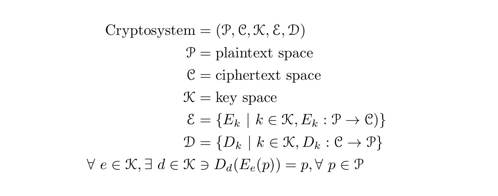

# Cryptography in a Nutshell

### Contents
[Why Cryptography?](#why-cryptography)

[The Golden Rule](#the-golden-rule)

[What Is Cryptography?](#what-is-cryptography)

[The Cryptosystem](#the-cryptosystem)

[Keys](#keys)

[Encryption Algorithms](#encryption-algorithms)

*[Back](../week2-cryptography#week-2---cryptography)*

## Why Cryptography?
The "C" and the "I" in the CIA Triad

## The Golden Rule
DON'T ROLL YOUR OWN CRYPTO!!!

## What Is Cryptography?
__Cryptography__: The process of communicating secretly through the use 
of ciphers

__Cryptanalysis__: The process of cracking or deciphering encrypted info

__Cryptology__: The study of cryptography or cryptanalysis

__Cleartext / plaintext__: Unencrypted infomation

__Encrypt__: To convert info or data into code to prevent unauthorized
access

__Decrypt__: To convert an encoded or unclear message into plaintext

__Cipher__: An algorithm to perform encryption and / or decryption

__Cryptosystem__: A suite of algorithms used to perform encryption and / or 
decryption

__Base64__: An encoding scheme used for representing binary data using 
printable (text) characters
- Used for HTTP Basic Authentication

## The Cryptosystem
A cryptosystem can be formalized as a tuple consisting of 5 elements: 
P, C, K, E, and D (see mathematical definition below). 'P' represents 
a set containing information in plaintext. 'C' represents a set 
containing information in ciphertext. 'K' represents a set containing 
keys. 'E' represents a set of functions such that for every key 'k', 
there exists a function from 'P' to 'C'. In other words, E represents 
a set of functions, each corresponding to a unique key, who encrypt 
information in plaintext. 'D' represents a set of functions such that 
for every key 'k', there exists a function from 'C' to 'P'. In other 
words, 'D' represents a set of funcions, each corresponding to a 
unique key, who decrypts information in ciphertext.

Therefore, a cryptosystem contains information in plaintext, information 
in ciphertext, keys, encryption functions, and decryption functions.

## Keys
In the context of cryptography, a key defines the transformation 
between plaintext and ciphertext. For encryption algorithms, the 
key specifies the transformation *from* plaintext *to* ciphertext. 
For decryption algorithms, the key specifies the transformation 
*from* ciphertext *to* plaintext.

> Il faut qu’[un système cryptographique] n’exige pas le secret, 
et qu’il puisse sans inconvénient tomber entre les mains de l’ennemi. -
__Auguste Kerckhoffs, ["La cryptographie
  militaire"](https://petitcolas.net/kerckhoffs/la_cryptographie_militaire_i.htm)__

In English:
> It is paramount that a cryptosystem does not rely on its key, and that 
there would be no problems if the cryptosystem falls into the hands of the 
enemy. - __Auguste Kerckhoffs, "Military Cryptography"__

In other words, a good cryptosystem maintains security, even in the hands 
of others, as long as the key is kept safe.

### Uses of Keys
**_The Caesar Cipher_**

TODO

**_One-Time Pad (OTP)_**

TODO

## Encryption Algorithms

There are three main types of encryption algorithms: one-way algorithms, 
symmetric-key algorithms, and public-key algorithms.

### One-Way Algorithms
TODO

**_MD5 (Insecure)_**

TODO

**_SHA1 (Insecure)_**

TODO

**_SHA256 & SHA512_**

TODO

### Symmetric-Key Algorithms
TODO

**_DES_**

TODO

**_AES_**

TODO

**_RC4_**

TODO

### Public-Key Algorithms
TODO

**_Diffie-Hellman (DH)_**

TODO

**_RSA_**

TODO

